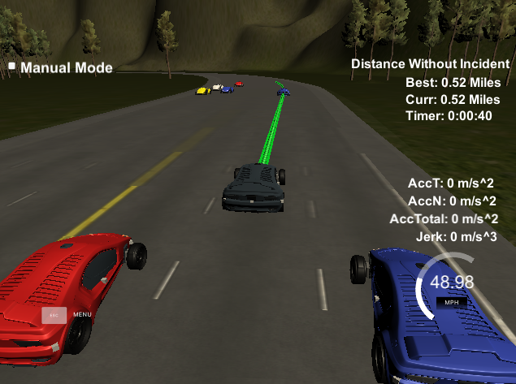

# Highway Path Planning for Autonomous Cars
<figure>
  
</figure>
 <p></p>
 
### Overview
In previous repositories, I've experimented with different types of controllers to make a car follow an ideal trajectory. I've also used a particle filter and types of Kalman filters with data from various sensors (LIDAR, RADAR, GPS) to track vehicles' location and movement. In this repository, I will address the problem of trajectory generation. Given a map of a highway, an accurate controller, and accurate sensor readings of the environment, how to generate optimal trajectories for the car so that it navigates the highway safely and legally as well as efficiently and smoothly to maximize rider experience? I find this problem exciting because solving it seems to make the car autonomous in a way that cruise control, or even automatic parallel parking, does not. Not to mention, navigating the road with other upredictable drivers, if only in simulation, raises the stakes and highlights the need for perfection in developing the car's software. 
 
The contents of this repository include:
```
root
|   README.md
|   CMakeLists.txt
|   cmakepatch.txt
|   install-mac.sh
|   install-ubuntu.sh
|   project_assignment.md
|
|___data
|   |   highway_map.csv
|
|___src
    |   main.cpp
    |   path_panner.cpp
    |   path_panner.h
    |   cost.h
    |   helper_functions.h
    |   spline.h
    |   json.hpp
```

### Update Predctions
After every sensor fusion data update for each car on the road, the model predicts a trajectory 5 seconds into the future (path_planner.cpp lines 47-126). In the simulator, since other cars often speed up or slow down quickly, a rough approximation of their trajectory is made using a moving average of their acceleration. This rough approximation works because the predictions are updated nearly 50 times per second. These predictions are used to choose possible trajectories to generate and to double-check to exclude paths with potential collisions when choosing a best trajectory.

In the update_predictions function, I also keep track of average lane speed of the 3 lanes on the autonomous or the ego car's side of the road (lines 72-87, 127-148). This is used to help determine the best trajectory later, but is calculated here for efficiency, avoiding having to loop through the sensor data car-by-car again later.

### Set Ego
After the predictions have been updated, the ego car's current x-y coordinates and s-d (frenet coordinates) are set based on latest localization data (path_planner.cpp lines 153-199). The goal of every update is to generate a 5 second optimal trajectory. Since the car updates significantly faster than that, to smooth its decisions without losing the ability to respond to sudden changes in the environment, like a car veering suddenly into ego's lane, the current ego state is set with the first half-second of whatever remains of the previous optimal trajectory (lines 159-164). Given the first half-second, the goal is to choose an optimal trajectory for the next 4.5 seconds.

### Behavior Planning
Highway driving, for the most part, consists of predictable behavior patterns, e.g. keep velocity, follow or maintain car's velocity in front of ego with a buffer distance, or change lanes left or right with the previous described velocities, or slow down or speed up to prepare for a lane change, or stop. Therefore, there is an impulse to use a finite state machine. One can generate a number of trajectories for each state, using a normal distribution for each state's duration and end position, rule out trajectories that end in collision, and run the rest through a cost function to choose the next best state.

One problem, at least on my computer, is that running anything more than 50 trajectories through a cost function wastes too much computation time at the expense of ego's ability to react to sudden environmental changes, making it difficult to have ego safely and efficiently pass slower traffic. 

Therefore, ego can only ever be in 1 of 2 states, keep lane or change lane (technically 3 states if ego is in the middle lane). After ego's state is set, the generate_best_trajectory function is called and it generates 2 sets (3 if in middle lane) of trajectories, one for keep lane and one for change lane, returning the trajectory with the lowest cost (path_planner.cpp lines 201-293).

### Trajectory Generation
Regardless of whether the next state is keep or change lane, the same function is called, generate_lane_trajectory, to generate 9 potential trajectories, 18 or 27 in total. If there is a car in front of ego's current state within approximately the max distance it can travel in 5 seconds going its top speed, the speed limit, in the goal lane, then 3 goal points are created. Each is in the center of that car's lane 0.5, 0.75, and 1 second behind the prediction of where that car will be 5 seconds from now. A half-second leaves about 2 car lengths, so the maximum farthest distance should maintain a safe distance, depending on prediction accuracy (path_planner.cpp lines 306-331).

If no car is in front of ego within its maximum possible range in its goal lane, then 3 different points are created. The first point is in the center of the goal lane at the max distance it can travel given its current velocity and maximum acceleration threshold, which I set conservatively at 5 m/s2, avoiding any longitudinal acceleration or jerk issues. The next 2 points are 10 and 20 meters behind the first (lines 332-339).

Regardless of whether a car is in front of ego in the goal lane, 3 points are generated at the distance where ego will reach the goal lane's center, called gap distance, determining how sharp the lane change will be or how quickly ego will recenter itself in its current lane. The 3 distances are chosen conservatively, avoiding any lateral acceleration or jerk issues (lines 341-372).

Combnined, there are 9 trajectories, which account for many sorts of behavior states not explicitly programmed, offering a bit of functional fluidity. For example, imagine that ego is in the middle lane with no cars in front of it, but cars are in front of ego in the lanes on either side. Suddenly, the car in the left lane brakes hard and merges into ego's lane for no apparent reason. Ego may not be able to slow down in its current lane quickly enough to avoid collision, so it will slow down and merge quickly to the lane on its right, going much slower than necessary to follow the car in the right lane because slowing kept a safe distance from the car in the old lane. The same state (i.e. the shortest gap and shortest distance goal point) could also be chosen to merge if a slow car is in front of ego and a fast car just passed ego on the right and another slightly slower car is a few car lengths behind the fast car. Ego will slow down and merge quickly between the 2 cars on the right before picking up speed to match the faster car. Ego can prep lane changes and perform different types of lane changes without having to be told that is what it needs to do. In other words, it seems to me that diffent types of trajectories perform different functions or represent different behavior states at different times. The shape of the trajectory is more important or fundamental than the behavior state.

For each trajectory, a spline is fit to the last 2 points of the leftover previous trajectory and 4 points in the goal lane spaced the gap distance apart (lines 383-429). Given the goal distance and current speed, the acceleration is calculated necessary to achieve the distance (line 452). This acceleration is an estimate because the goal distance is calculated assuming the path will be linear. This works well on a highway because the road curves are not extreme. If anything it is a conservative estimate that understimates ego's acceleration so does not sacrifice safety. With current velocity and necessary acceleration, 250 points along the spline (minus those leftover from the previous path) are calculated spaced 0.02 seconds a part (lines 463-490). 

### Choosing Optimal Trajectory
There are 4 cost functions that are weighted and added together to form a final cost for each trajectory. The trajectory with the lowest cost is chosen.

<figure>
  
</figure>
 <p></p>
where Cc is collision cost, Ci is inefficiency cost, Csd is s distance cost, Cdd is d distance cost, and the K's are their respective weights.

When calculating the 250 points, there are checks ensuring that the velocity, acceleration, and jerk never pass their limits. Along with the goal distances described above, this should ensure that there are no collisions. Collisions, however, can sometimes occur when other cars decelerate or change lanes rapidly. Or ego may find itself too close for comfort to a car. Therefore, all 18 or 27 trajectories are run through a Boolean collision cost function with a large buffer of 10m in front or behind and 2.75m on either side of ego. If at any timestamp along a potential trajectory any car on the road at that timestamp is within the buffer, cost = 1. Kc = 100. Therefore, if a trajectory doesn't pass the collision test it will not be chosen (cost.h lines 76-102).

The inefficiency cost is:

<figure>
  
</figure>
 <p></p>
where Vcl is the average velocity of ego's current lane, Vil is of ego's goal lane, Vfl is of the fast lane. Ki = 10. Also, if the fast lane is 2 lanes over from ego, ego treats the lane 1 lane over as the fast lane, encouraging 2 lane switches when appropriate, for example see the below image making the first of a two lane change (cost.h lines 25-41).

<figure>
  
</figure>
 <p></p>
 
The s distance cost is:
<figure>
  
</figure>
 <p></p>
where Smax is the maximum distance ego can travel at the max velocity, and S is the s distance ego would travel on this trajectory or the difference between the end s frenet coordinate and the start s. Ks = 1 (cost.h lines 63-73). 

The d distance cost is the percentage of the time along the trajectory the d frenet coordinate is greater than 1m away from the center of the goal lane. Kd = 1 (cost.h lines 44-60).

### Results
<figure>
  
</figure>
 <p></p>
Given the current K values, ego's priority is to be in the fast lane, except when the fast lane is barely faster than another lane, then both the s and d distance costs encourage maintaining the current lane or the smoothest possible lane change. The constraints built into the trajectory generation steps ensure ego maintains a safe distance and speed. That said, lowering Ki goes a long way in creating a less impatient car. In the simulation most cars travel significantly under the speed limit, and with the current weights ego can weave in and out of traffic perhaps more than an autonomous car should.
